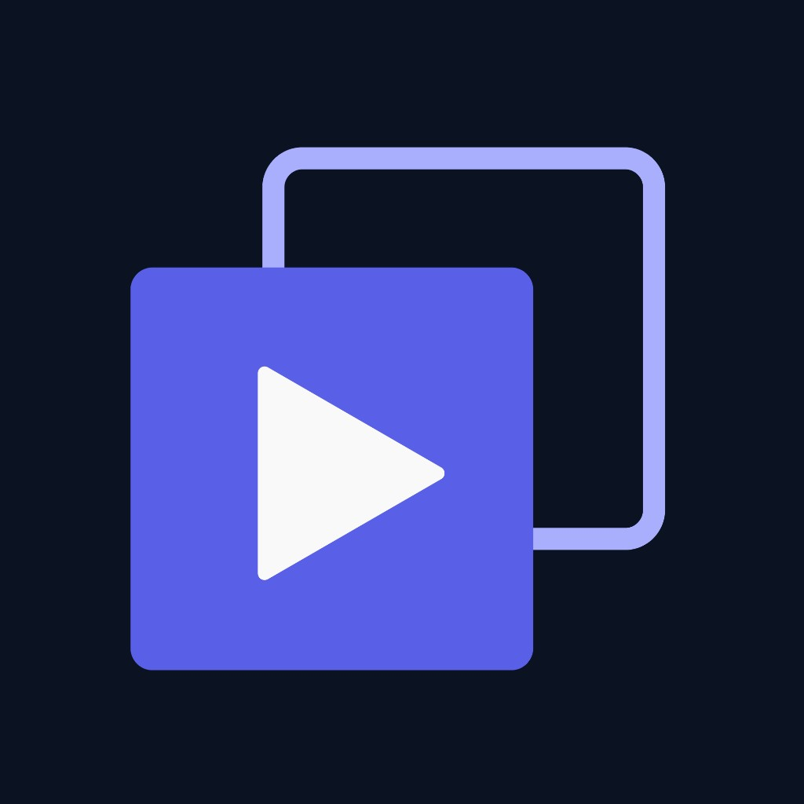

# Focal

---

## Logo

**Official logo** — created in Canva. Stacked rounded squares with a white play icon.

| Part | Hex |
|------|-----|
| Background | `#0B1222` |
| Back square (outline) | `#ABB0F2` |
| Front square (solid) | `#595FE7` |
| Play triangle | `#FFFFFF` |

**File:** `docs/branding/focal-logo.png`

---

## Colors

| Role | Hex | Used for |
|------|-----|----------|
| Primary | `#595FE7` | Recap button, Play segment, checkbox |
| Primary hover | `#4A50D4` | Button hover |
| Accent | `#ABB0F2` | Logo outline square, highlights |
| Text / panel bg | `#0B1222` | Body text, key moment panel |
| Panel text | `#FFFFFF` | Text on dark panel |
| Popup bg | `#FFFFFF` | Pause popup, toolbar popup |

---

## Font

**Inter** (Google Fonts) — weights 400, 500, 600, 700

| Element | Style |
|---------|--------|
| Wordmark | Bold 700, letter-spacing `-0.02em` |
| Section label | SemiBold 600, 13px, uppercase, `#6B7280` |
| Body | Regular 400, 13–14px |
| Buttons | SemiBold 600, white on `#595FE7` |

---

## UI

### Pause popup (top-right on YouTube)
- White card, 280px wide, 12px radius
- Gray uppercase “FOCAL” label
- Status: “Paused at 4:46. Ready for recap.”
- Primary **Recap** button (`#595FE7`)
- **Voiceover** checkbox (accent `#595FE7`)

### Key moment panel (bottom-right after recap)
- Dark panel `#0B1222`, text `#FFFFFF`
- Title: timestamp + moment name
- Description paragraph
- Nav: ← **Key moment 2 of 5** →
- Primary **Play segment** button

### Toolbar popup
Same styling as pause popup.

---

## Summary

| | |
|---|---|
| **Name** | Focal |
| **Logo** | Canva — stacked squares + white play icon |
| **Primary** | `#595FE7` |
| **Font** | Inter |

**Visual reference:** [`focal-brand-guide.html`](focal-brand-guide.html)
